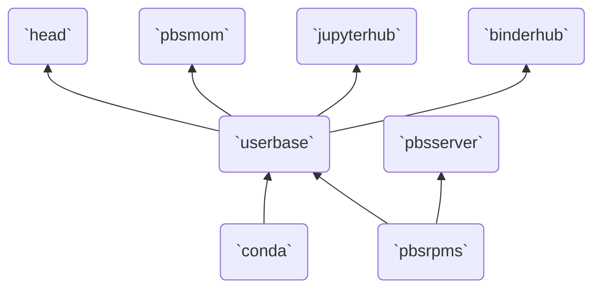

# Docker Images

The subdirectories contained in this directory define different Docker images
for use in this project. Each subdirectory contains a `Dockerfile` defining
how to build the image, as well as any additional files needed for the image
during build time.

All images are based on the CentOS 8.4.2105 image.



## How to Build

To build these images, all you should need is Docker Engine. Optionally,
if you have `make` on your system, you can build all images with one command:

```bash
$ make
```

from within this directory.

If you do not have a system with `make`, but you do have Docker installed on your system,
you can build each individual image by running:

```bash
$ docker build --tag IMGNAME IMGNAME
```

which assumes that each image will be tagged with the same name as the directory corresponding
to the image.

Due to the dependencies shown in the above dependency graph, I recommend you build
these images in the following order:

1. `pbsrpms`
2. `pbsserver`
3. `conda`
4. `userbase`
5. `pbsmom`
6. `head`
7. `jupyterhub`
8. `binderhub`

## Individual Images

Below are the individual images built for this demonstration.

### Conda Image

The `conda` image builds and installs [Miniconda](https://docs.conda.io/en/latest/miniconda.html).
In the base Conda environment, the main Jupyter-based software is installed, including
JupyterHub and BinderHub and all dependencies for the specific deployments.
This software is installed in the `/opt/conda` directory, which is then copied
into the corresponding directory on each image where Jupyter-based software
needs to be run (i.e., on all `userbase` images).

### PBS RPMS Image

The `pbsrpms` image builds the OpenPBS RPMs for installation in the necessary
PBS images:

- `userbase`, where the client RPM is installed,
- `pbsmom`, where the MOM RPM is installed, and
- `pbsserver`, wheree the server RPM is installed.

### PBS Server Image

The `pbsserver` image installs the OpenPBS server RPM from the `pbsrpms` image
and configures the server to run in the local network.

### User Base Image

The `userbase` image contains all of the client and user-facing software. It copies
over the `/opt/conda` software from the `conda` image, as well as the OpenPBS Client RPM
from the `pbsrpms` image, from which the OpenPBS Client is installed. It installs
the OpenSSH Client, as well. In addition to installing this software, it configures
all of these services so that they can be used from within the container. This image
also creates and defines permissions for all _users_ on the JupyterHub and BinderHub
systems.

### PBS MOM Image

This image installs the OpenPBS MOM RPM for the "compute nodes" from the
`pbsrpms` image. Since user code is expected to run on the compute nodes, this
image is built from the `userbase` image. Containers running this image can be
used to model "compute nodes" on the HPC cluster.

### Head Image

The `head` image installs and configures the OpenSSH server so that all users defined
in the `userbase` image can SSH into the node with their password. Hence, this
image is built from the `userbase` image.

### JupyterHub Image

The `jupyterhub` image installs and configures the JupyterHub service to run as
the `admin` user. This image is built from the `userbase` image. It exposes port
8000 so that the JupyterHub can be accessed from your local machine's browser
(via `http://localhost:8000`).

_NOTE: Since the users defined in the `userbase` image are also installed in this
image, the JupyterHub authentication is handled with the default PAM Authentication
method._

### BinderHub Image

The `binderhub` image installs and configures the BinderHub to use the JupyterHub
service provided by the `jupyterhub` image. It is built from the `userbase` image.
This image exposes port 8585 so that the BinderJub can be accessed from your local
machine's browser (via `http://localhost:8585`).
